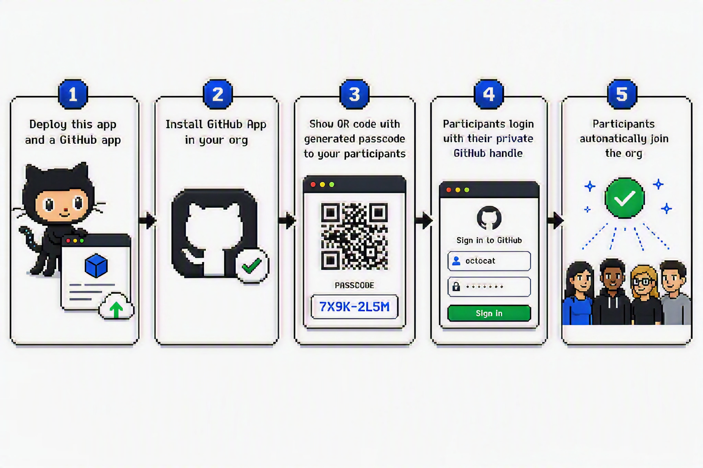
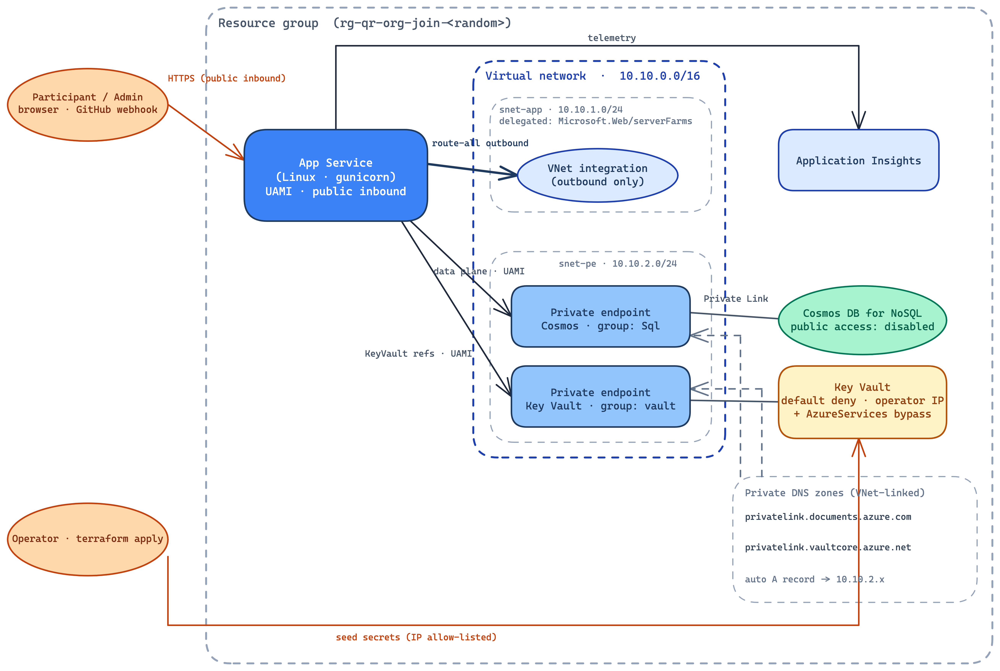
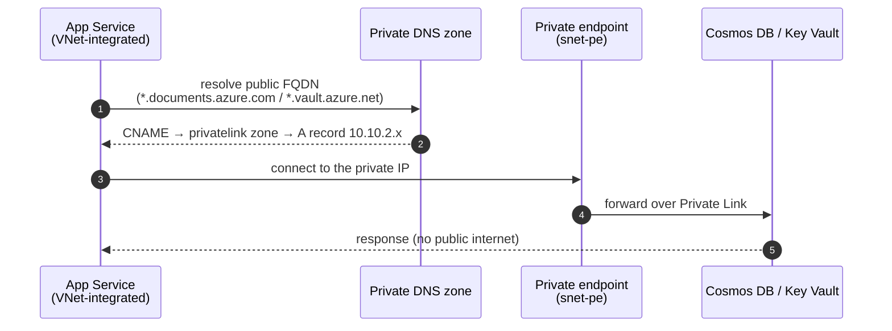

# QR Org Join

<p align="center">
  
</p>

A small Flask app that lets people self-join a GitHub organization by scanning a
per-org QR code.

## Why QR Org Join

**Running a hackathon for 100 people? Onboarding every one of them into your own
GitHub organization by hand - collecting usernames, firing off invitations one by
one, and chasing the stragglers - is a genuinely painful afternoon.** QR Org Join
collapses that into a single QR code on a slide: attendees scan it, sign in with
GitHub, type a passcode, and invite themselves.

<p align="center">
  
</p>

In short: the admin **installs** the GitHub App (which auto-onboards the org) and
**projects** its QR code and passcode; each participant **scans**, **signs in**
with GitHub, enters the **passcode**, and is **invited** - accepting on GitHub
completes the join. No manual username collection, no one-by-one invites. The
step-by-step detail is below.

## How it works

1. An admin installs the **GitHub App** on an org - the `installation` webhook
   auto-onboards it with a generated **join passcode** and records who installed
   it. In the Entra-protected console the admin opens the org's QR code and
   passcode.
2. A participant scans the QR code, landing on `/orgs/<slug>`.
3. They click **Sign in with GitHub** - an OAuth App with *empty scope* tells us
   only their login.
4. They enter the org's **join passcode** and click **Join** - the server
   verifies the passcode, creates an org invitation using the GitHub App's
   per-org installation token (least privilege: *Members: write*), and
   best-effort assigns the invitee a **Copilot** seat (skipped if the org has no
   Copilot plan/seats).
5. They accept the invitation on GitHub to finish joining (any assigned Copilot
   seat activates on acceptance).

### Three credentials, each at minimum privilege

| Credential | Purpose |
| --- | --- |
| Entra ID app role (via Easy Auth) | Authorizes the admin for the console |
| GitHub OAuth App (empty scope) | Identifies the participant |
| GitHub App (*Members* + *Copilot Business*: write) | Creates each org invitation and assigns a Copilot seat, via per-org installation tokens |

The GitHub App is **installed per org** (not an owner), holds only
*Organization → Members* and *GitHub Copilot Business* (write), and mints
short-lived per-org installation tokens. Installing it on an org also fires an
`installation` webhook that **auto-onboards** that org (see below).

## Deploy to Azure

Infrastructure lives in [`infra/`](infra/) as a **single Terraform layer** you
run yourself (local state, `az login`): a resource group, Linux App Service Plan
(**S1**) + Web App (Python, gunicorn), a **private Cosmos DB** and **Key Vault**
(reached over private endpoints via VNet integration), Application Insights, and
the Entra app registration with an **admin** app role wired into App Service Easy
Auth ("allow unauthenticated" so participants pass through).

All secrets live in Key Vault and are surfaced to the app as
`@Microsoft.KeyVault(...)` references resolved by the app's managed identity over
the vault's private endpoint. **Cosmos** has public network access **disabled**
(reachable only via its private endpoint). **Key Vault** denies public traffic by
default but allows your `operator_ip_cidr` (plus the `AzureServices` bypass) so
Terraform can seed the secrets; the app still reads them over the private
endpoint. Inbound to the app stays public (participants scan the QR; GitHub POSTs
the webhook).

### Required roles (before you start)

Grant yourself these before applying:

| Scope | Role |
| --- | --- |
| Subscription (or the target RG) | **Owner** - or **Contributor + User Access Administrator** |
| Entra directory | **Application Administrator** (or Cloud Application Administrator) |
| Key Vault (data plane) | **Key Vault Secrets Officer** (Terraform grants this during apply; your public IP must be in `operator_ip_cidr`) |
| GitHub | Account **Developer settings** access; **Org owner** on each joinable org |

> Verify quickly: `az role assignment list --assignee $(az ad signed-in-user show --query id -o tsv) --all -o table` should show Owner (or Contributor + User Access Administrator). Entra roles are visible under **Entra admin center → Roles and administrators**.

### Prerequisites
- [Azure CLI](https://learn.microsoft.com/cli/azure/install-azure-cli) and
  [Terraform](https://developer.hashicorp.com/terraform/install) installed
  (`deploy.sh` checks both are on your PATH before doing anything).
- `curl` and `openssl` (used by `deploy.sh` to validate your GitHub credentials
  before deploying; no Python needed).
- The roles above, and `az login` to the target subscription.

You do **not** invent an `app_name`: Terraform auto-generates a globally-unique
`qr-org-join-<random>`. Because that name becomes the app's URL (and the GitHub
callback/webhook URLs), deployment is inherently **two-phase**: resolve the name
first, set up GitHub against the real URLs, then apply everything. `deploy.sh`
runs both phases and walks you through the GitHub setup in between.

### Deploy: run `./deploy.sh` (recommended)

```bash
az login
az account set --subscription <subscription-id>

cd infra
cp terraform.tfvars.example terraform.tfvars
# In terraform.tfvars set operator_ip_cidr to your public IP as x.x.x.x/32
#   (curl -s https://api.ipify.org). Leave app_name empty and the github_*
#   values as placeholders for now.

./deploy.sh
```

`deploy.sh` runs the whole flow and pauses once for the GitHub setup:

1. **Checks prerequisites** that `terraform` and `az` are installed.
2. **Phase 1: resolves the name (no Azure resources yet).** It applies only the
   random values, so it learns the app URL
   (`https://<app_name>.azurewebsites.net`) and generates the GitHub **webhook
   secret**. Nothing is created in Azure at this point.
3. **Prints the GitHub tasks and waits.** It shows the exact Homepage / callback /
   webhook URLs and the webhook secret, colour-coded (red = paste into GitHub,
   orange = copy back into `terraform.tfvars`), then pauses. You do the GitHub
   setup (next section) and press Enter.
4. **Validates your GitHub credentials** against GitHub (the OAuth client
   id/secret and the GitHub App ID + `github-app.pem`) and stops with specific
   guidance if anything is wrong, so a typo is caught before any Azure resource
   exists.
5. **Phase 2: applies everything** in dependency order: resource group, VNet +
   subnets + private DNS, private Cosmos + Key Vault, Application Insights, the
   Entra app + admin role, all role assignments, Key Vault secrets (written over
   your allow-listed IP), private endpoints, and the VNet-integrated App Service.
6. **Prints the code-deploy command** (`az webapp up ...`) to run next.

> If the apply fails writing a Key Vault secret with a **403**, the just-created
> *Key Vault Secrets Officer* assignment usually hasn't propagated yet: wait
> ~1 minute and re-run. If it persists, re-check your outbound IP (VPN/proxy/NAT
> can change it) and update `operator_ip_cidr`.

### The GitHub setup (by hand, since GitHub can't be automated)

When `deploy.sh` pauses, create two GitHub apps and paste three values back into
`terraform.tfvars`. The script prints the exact URLs and the webhook secret; here
is what each app is for.

**1. GitHub OAuth App** identifies the participant (empty scope: we only read
their login). At <https://github.com/settings/developers> → **New OAuth App**:
- **Homepage URL:** `<app_url>`
- **Authorization callback URL:** `<app_url>/callback`

Copy the **Client ID** and generate a **client secret** → `github_client_id` /
`github_client_secret`.

**2. GitHub App** sends the invitations and receives the install webhook. At
<https://github.com/settings/apps> → **New GitHub App**:
- **Permissions → Organization:** *Members* = **Read & write** (send invites);
  *GitHub Copilot Business* = **Read & write** (best-effort Copilot seat).
- **Subscribe to events:** **Installation**.
- **Webhook:** Active; **URL** = `<app_url>/webhooks/github`; **Secret** = the
  `github_webhook_secret` the script printed (generated by Terraform).
- **Generate a private key** and save the `.pem` as `infra/github-app.pem`
  (gitignored; Terraform reads it from there, you never paste its contents).

Copy the numeric **App ID** → `github_app_id`.

> Only **three values** go into `terraform.tfvars`: `github_client_id`,
> `github_client_secret`, `github_app_id`. The webhook secret already lives in
> Terraform state, and the private key is the `.pem` file.

> Copilot seats are **best-effort**: if an org has no Copilot Business/Enterprise
> plan (or no free seats), the invitation still succeeds and the seat is skipped.
> Assigning a seat needs the org to have granted the *GitHub Copilot Business*
> permission; if you add it after first install, org owners must approve it.

### After the apply: finish deploying

**Deploy the application code** from the repo root (the script prints this exact
command with the resolved values filled in):
```bash
az webapp up \
  --name <app_name> \
  --resource-group <resource_group_name> \
  --plan <app_service_plan_name> \
  --location <location> \
  --runtime "PYTHON:3.12"
```
App Service builds the source with Oryx (`pip install -r requirements.txt`) and
runs `gunicorn app:app`. *Role: **Website Contributor** (or Contributor) on the
Web App.* For repeatable CI deploys, see
[CI/CD](#cicd-github-actions-oidc--no-stored-secrets).

**Grant admin access** (skip if you set `admin_principal_object_ids`): Entra
admin center → **Enterprise applications** → `<app_name>-admin` → **Users and
groups** → add users with the `admin` role.

**Install the GitHub App on each org**: the app's page → **Install App** → pick
the org (requires **org owner**). Installing grants only *Members* + *Copilot
Business* write (not ownership) and fires the `installation` webhook, which
**auto-onboards** the org into the list.

**Verify:** `<app_url>/healthz` returns `{"status":"ok"}`; open `/admin` (Entra
sign-in), confirm the org appears, open its QR, scan it, and complete the join.

> **Custom / regional hostname:** all URLs derive from the resolved name. If
> Azure assigns a different hostname (custom domain or unique-default-hostname),
> set `app_base_url = "https://<actual-host>"` in `terraform.tfvars`, re-apply,
> and update the GitHub OAuth callback + GitHub App webhook URL to match.

<details>
<summary><b>Manual alternative: run the two phases yourself (no deploy.sh)</b></summary>

Everything `deploy.sh` does maps to plain Terraform. Do the GitHub setup (above)
between the two phases.

```bash
cd infra
cp terraform.tfvars.example terraform.tfvars   # set operator_ip_cidr

# Phase 1: resolve the name + webhook secret (no Azure resources yet)
terraform init
terraform apply -target=random_string.suffix -target=random_password.webhook_secret
terraform output -raw app_url                # -> Homepage/callback URLs
terraform output -raw github_webhook_secret  # -> GitHub App webhook secret

# ... now create the GitHub OAuth App + GitHub App (see above), fill the three
#     github_* values in terraform.tfvars, and save infra/github-app.pem ...

# Phase 2: apply everything
terraform apply
```

The hostname is deterministic (`https://<app_name>.azurewebsites.net`) and, once
fixed in state during phase 1, does not change on the full apply. *Roles:
**Owner** (or Contributor + User Access Administrator) for the role assignments;
**Application Administrator** for the Entra objects; your IP in `operator_ip_cidr`
for the Key Vault secret writes.*

</details>

## CI/CD (GitHub Actions, OIDC - no stored secrets)

Infrastructure is **not** driven from CI - you apply `infra/` yourself with
`az login` and local state. Only **app code** ships from GitHub Actions:

- **`.github/workflows/deploy-app.yml`** - runs on pushes that touch app code
  (`**.py`, `templates/**`, `requirements.txt`). Logs in via GitHub **OIDC** and
  ships the source to App Service (Oryx builds it). It authenticates with a
  federated credential (no client secret / publish profile) against a
  least-privilege identity - **Website Contributor on the Web App only**.

This deploy identity is **separate from `infra/`**. Create it once (or reuse an
existing one), grant it *Website Contributor* on the Web App, and add a GitHub
OIDC **federated credential** whose subject matches this repo's `production`
environment - otherwise `azure/login` fails even if the IDs are set:

```bash
APP_NAME=$(terraform -chdir=infra output -raw app_name)
RG=$(terraform -chdir=infra output -raw resource_group_name)
REPO="jeffrey-groneberg/gh_org_qr_join"   # owner/name

# 1. Identity for deploys (Contributor to create it).
az identity create -g "$RG" -n "${APP_NAME}-deploy"
CLIENT_ID=$(az identity show -g "$RG" -n "${APP_NAME}-deploy" --query clientId -o tsv)
PRINCIPAL_ID=$(az identity show -g "$RG" -n "${APP_NAME}-deploy" --query principalId -o tsv)

# 2. Least-privilege role on the Web App only (needs User Access Administrator/Owner).
WEBAPP_ID=$(az webapp show -g "$RG" -n "$APP_NAME" --query id -o tsv)
az role assignment create --assignee-object-id "$PRINCIPAL_ID" \
  --assignee-principal-type ServicePrincipal \
  --role "Website Contributor" --scope "$WEBAPP_ID"

# 3. Trust GitHub Actions from the `production` environment of this repo.
az identity federated-credential create -g "$RG" \
  --identity-name "${APP_NAME}-deploy" --name gh-prod \
  --issuer https://token.actions.githubusercontent.com \
  --subject "repo:${REPO}:environment:production" \
  --audiences api://AzureADTokenExchange
```

Then set the repo's `production` environment values (Settings → Environments):

| Kind | Name | Value |
| --- | --- | --- |
| Variable | `AZURE_WEBAPP_NAME` | `terraform -chdir=infra output -raw app_name` |
| Secret | `AZURE_CLIENT_ID` | the `$CLIENT_ID` above |
| Secret | `AZURE_TENANT_ID` | your tenant ID |
| Secret | `AZURE_SUBSCRIPTION_ID` | your subscription ID |

> Code deploys reach the App Service SCM (Kudu) endpoint, which stays public;
> only the app's **outbound** dependencies (Cosmos, Key Vault) are private.

## Layout

- `app.py` - pure app factory `create_app(config, store, github)` + composition root
- `config.py` - env-driven configuration (the only place that reads `os.environ`)
- `models.py` - `Org` dataclass (Cosmos document)
- `org_store.py` - `OrgStore` interface + `CosmosOrgStore` implementation
- `auth.py` - Easy Auth admin gate (`admin_required`)
- `github_client.py` - GitHub App client (OAuth identity + per-org invitations)
- `webhooks.py` - HMAC-verified `installation` webhook (auto-onboard/remove orgs)
- `telemetry.py` - Azure Monitor / Application Insights wiring (config-driven)
- `admin.py` - admin console: passcode management, QR page, org check + remove
- `participants.py` - GitHub OAuth identity + join
- `templates/` - server-rendered Jinja (Microsoft Fluent / M365 Copilot theme)
- `infra/` - Terraform: App Service (VNet-integrated), private Cosmos + Key Vault,
  private endpoints/DNS, Entra app (single user-run local-state layer)
- `.github/workflows/deploy-app.yml` - app-code deploy (OIDC, independent of infra)

## Network architecture

The App Service is **VNet-integrated**: its outbound traffic is routed into a
private VNet, so it reaches Cosmos DB and Key Vault over **private endpoints**
(never the public internet). Two subnets keep concerns separate - the delegated
integration subnet can't also host private endpoints. Inbound to the app stays
public so participants can scan the QR and GitHub can POST the webhook.

<p align="center">
  
</p>

**How a private lookup resolves** - the linked private DNS zones make the public
hostnames resolve to a private IP inside `snet-pe`, so the connection stays on
Private Link. Terraform declares the zones and their VNet link; each private
endpoint's `private_dns_zone_group` then **auto-creates and maintains** the A
records - you never write them by hand:



## Observability

Terraform provisions a **Log Analytics workspace** and a workspace-based
**Application Insights** component, and injects its connection string as the
`APPLICATIONINSIGHTS_CONNECTION_STRING` app setting. On startup the app calls
`telemetry.configure_telemetry()`, which uses Azure Monitor OpenTelemetry to
auto-instrument Flask requests, outbound GitHub calls, and the Python `logging`
module - so request traces, dependencies, and the app's own logs all flow to
Application Insights with trace correlation. View them under the
`<app_name>-ai` resource (Logs / Transaction search / Live metrics). Telemetry
is a no-op when the connection string is unset.
