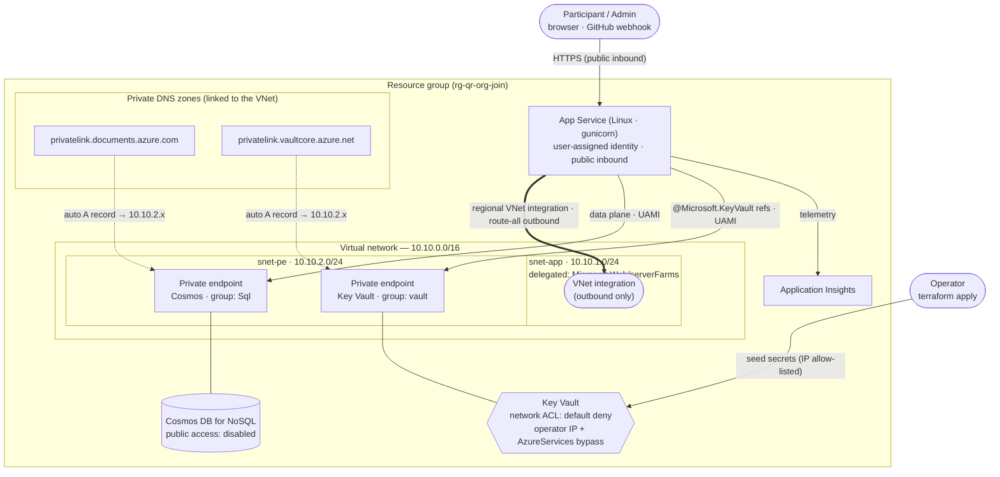
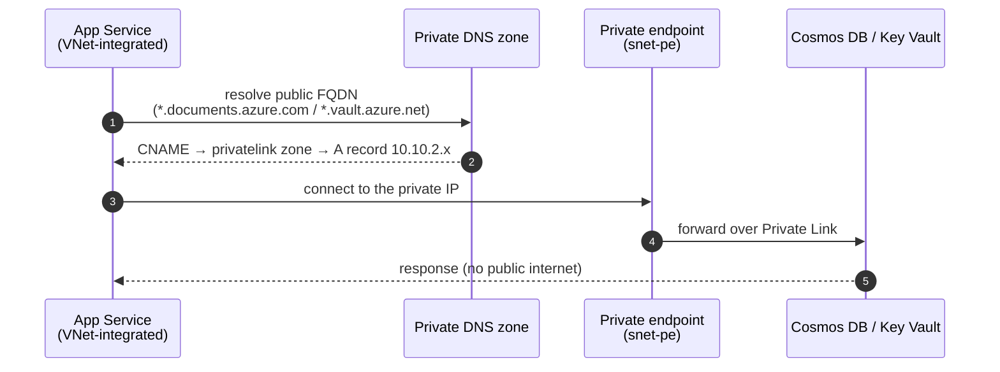

# QR Org Join

<p align="center">
  
</p>

A small Flask app that lets people self-join a GitHub organization by scanning a
per-org QR code. Organizations are onboarded automatically when the **GitHub App**
is installed on them; an **admin** views them in an Entra-protected console,
manages each org's join passcode, and projects its QR code. A **participant**
scans the code, signs in with GitHub (identity only), enters the join passcode,
and is invited into that org.

Member management — accepting invitations, roles, removals — stays on
GitHub.com. This app only creates the invitation.

Installing the GitHub App on an org **auto-onboards** it (via the `installation`
webhook); uninstalling **removes** it. From the console, **Check** re-validates an
org against GitHub and reports one of: the app is installed and can invite (OK),
the app is not installed (not installed), or the org no longer exists (missing).
**Remove** deletes a stale entry (e.g. if an uninstall webhook was missed).

## How it works

1. An admin installs the **GitHub App** on an org — the `installation` webhook
   auto-onboards it with a generated **join passcode** and records who installed
   it. In the Entra-protected console the admin opens the org's QR code and
   passcode.
2. A participant scans the QR code, landing on `/orgs/<slug>`.
3. They click **Sign in with GitHub** — an OAuth App with *empty scope* tells us
   only their login.
4. They enter the org's **join passcode** and click **Join** — the server
   verifies the passcode, creates an org invitation using the GitHub App's
   per-org installation token (least privilege: *Members: write*), and
   best-effort assigns the invitee a **Copilot** seat (skipped if the org has no
   Copilot plan/seats).
5. They accept the invitation on GitHub to finish joining (any assigned Copilot
   seat activates on acceptance).

### Three credentials, each at minimum privilege

| Credential | Purpose |
| --- | --- |
| Entra ID app role (via Easy Auth) | Authorizes the admin for the console |
| GitHub OAuth App (empty scope) | Identifies the participant |
| GitHub App (*Members* + *Copilot Business*: write) | Creates each org invitation and assigns a Copilot seat, via per-org installation tokens |

The GitHub App is **installed per org** (not an owner), holds only
*Organization → Members* and *GitHub Copilot Business* (write), and mints
short-lived per-org installation tokens. Installing it on an org also fires an
`installation` webhook that **auto-onboards** that org (see below).

## Deploy to Azure (step by step)

Infrastructure lives in [`infra/`](infra/) as a **single Terraform layer** you
run yourself (local state, `az login`): a resource group, Linux App Service Plan
(**S1**) + Web App (Python, gunicorn), a **private Cosmos DB** and **Key Vault**
(reached over private endpoints via VNet integration), Application Insights, and
the Entra app registration with an **admin** app role wired into App Service Easy
Auth ("allow unauthenticated" so participants pass through).

All secrets live in Key Vault and are surfaced to the app as
`@Microsoft.KeyVault(...)` references resolved by the app's managed identity over
the vault's private endpoint. **Cosmos** has public network access **disabled**
(reachable only via its private endpoint). **Key Vault** denies public traffic by
default but allows your `operator_ip_cidr` (plus the `AzureServices` bypass) so
Terraform can seed the secrets; the app still reads them over the private
endpoint. Inbound to the app stays public (participants scan the QR; GitHub POSTs
the webhook).

### Required roles (before you start)

Grant yourself these before applying:

| Scope | Role |
| --- | --- |
| Subscription (or the target RG) | **Owner** — or **Contributor + User Access Administrator** |
| Entra directory | **Application Administrator** (or Cloud Application Administrator) |
| Key Vault (data plane) | **Key Vault Secrets Officer** (Terraform grants this during apply; your public IP must be in `operator_ip_cidr`) |
| GitHub | Account **Developer settings** access; **Org owner** on each joinable org |

> Verify quickly: `az role assignment list --assignee $(az ad signed-in-user show --query id -o tsv) --all -o table` should show Owner (or Contributor + User Access Administrator). Entra roles are visible under **Entra admin center → Roles and administrators**.

### Prerequisites
- [Azure CLI](https://learn.microsoft.com/cli/azure/install-azure-cli) and
  [Terraform](https://developer.hashicorp.com/terraform/install) installed.
- `curl` and `openssl` (used by `deploy.sh` to validate your GitHub credentials
  before deploying — no Python needed).
- The roles above.

You do **not** need to invent an `app_name` — Terraform auto-generates a
globally-unique `qr-org-join-<random>` name. Deployment is **two-phase**: resolve
the name first, configure GitHub with the real URLs, then apply everything.
`infra/deploy.sh` automates this; the manual steps are spelled out below.

### Step 1 — Sign in and select the subscription
```bash
az login
az account set --subscription <subscription-id>
curl -s https://api.ipify.org; echo       # -> operator_ip_cidr (append /32)
```
(The tenant is taken from your `az login` session — no need to set it.)

### Step 2 — Seed Terraform variables
```bash
cd infra
cp terraform.tfvars.example terraform.tfvars
```
Set `operator_ip_cidr` (`x.x.x.x/32`); leave `app_name` empty to auto-generate
and the `github_*` values as placeholders for now. Optionally set
`admin_principal_object_ids` to auto-assign yourself the admin role
(`az ad signed-in-user show --query id -o tsv`).

### Step 3 — Resolve the app name + webhook secret (phase 1, no resources yet)
```bash
terraform init
terraform apply -target=random_string.suffix -target=random_password.webhook_secret
terraform output -raw app_url                  # e.g. https://qr-org-join-ab12cd.azurewebsites.net
terraform output -raw github_webhook_secret    # paste into the GitHub App (Step 5)
```
This resolves the URL and generates the webhook secret **before any Azure resource
exists** (only random values are written to state). The hostname is deterministic
(`https://<app_name>.azurewebsites.net`) and, once fixed in state, won't change on
the full apply. Configure the GitHub OAuth App / GitHub App (Steps 4–5) against
these values. *Roles: none beyond `az login` — no Azure resources are created
here.* (Running `./deploy.sh` instead does this and prints both values.)

### Step 4 — Create the GitHub OAuth App (participant identity)
At <https://github.com/settings/developers> → **New OAuth App**:
- **Homepage URL:** `<app_url>`
- **Authorization callback URL:** `<app_url>/callback`

Copy the **client ID** and generate a **client secret** →
`github_client_id` / `github_client_secret`. *Role: your own GitHub account.*

### Step 5 — Create the GitHub App (invitations + webhook)
At <https://github.com/settings/apps> → **New GitHub App**:
- **Permissions → Organization:**
  - *Members* = **Read & write** (send invitations)
  - *GitHub Copilot Business* = **Read & write** (auto-assign a Copilot seat to
    the invitee; the seat activates when they accept)
- **Subscribe to events:** **Installation**.
- **Webhook:** Active; **URL** = `<app_url>/webhooks/github`; **Webhook secret** =
  the `github_webhook_secret` value from Step 3 (generated by Terraform).
- **Generate a private key** and save the downloaded `.pem` as `infra/github-app.pem`
  (gitignored; Terraform reads it from there).

Copy the **App ID** → `github_app_id`. The private key stays a file — you don't
paste it anywhere. *Role: your own GitHub account (installation comes later and
needs org owner).*

> Copilot seats are assigned **best-effort**: if an org has no Copilot
> Business/Enterprise plan (or no free seats), the invitation still succeeds — the
> seat is simply skipped. Assigning a seat needs the org to have granted the
> *GitHub Copilot Business* permission; if you add it after first install, org
> owners must approve the updated permission.

### Step 6 — Fill in the GitHub values
Set `github_client_id`, `github_client_secret`, and `github_app_id` in
`terraform.tfvars`, and make sure `infra/github-app.pem` exists (the webhook
secret is already in Terraform state, and the private key is read from the PEM
file — neither goes in tfvars).

### Step 7 — Apply everything (phase 2)
```bash
terraform apply           # or press Enter in ./deploy.sh
```
`deploy.sh` first **validates your GitHub credentials** (OAuth App client
id/secret and the GitHub App ID + `github-app.pem`) against GitHub and stops with
specific guidance if anything is wrong — so you catch a typo before any Azure
resource is created. Then Terraform creates, in dependency order (it resolves the
order for you):
1. Resource group, VNet + `snet-app`/`snet-pe`, private DNS zones + VNet links.
2. Cosmos DB (private), Key Vault (public traffic denied except your IP), App
   Insights.
3. Entra app registration + service principal + client secret + any admin role
   assignments.
4. Role assignments — app identity → *Cosmos Data Contributor* + *Key Vault
   Secrets User*; you → *Key Vault Secrets Officer*.
5. Key Vault secrets — the app credentials from your tfvars plus the Easy Auth
   client secret from step 3 — written over your allow-listed IP.
6. Private endpoints (+ auto DNS records) for Cosmos and Key Vault.
7. App Service (VNet-integrated) with the Key Vault-reference app settings.

*Roles: **Owner** (or Contributor + User Access Administrator) for step 4's role
assignments; **Application Administrator** for step 3's Entra objects; your IP in
`operator_ip_cidr` for step 5's secret writes.*

> If the first apply fails writing a Key Vault secret with a 403, the
> just-created *Secrets Officer* assignment usually hasn't propagated yet — wait
> ~1 minute and re-run `terraform apply`. If it persists, re-check your current
> outbound IP (VPN/proxy/NAT can change it) and update `operator_ip_cidr`.

### Step 8 — Deploy the application code
From the repo root, using the resolved name
(`terraform -chdir=infra output -raw app_name`):
```bash
az webapp up \
  --name <app_name> \
  --resource-group rg-qr-org-join \
  --runtime "PYTHON:3.12"
```
App Service builds the source with Oryx (`pip install -r requirements.txt`) and
runs `gunicorn app:app`. *Role: **Website Contributor** (or Contributor) on the
Web App.* For repeatable CI deploys instead, see
[CI/CD](#cicd-github-actions-oidc--no-stored-secrets).

### Step 9 — Grant admin access
If you didn't pass `admin_principal_object_ids`, assign users to the **admin**
app role: Entra admin center → **Enterprise applications** → `<app_name>-admin`
→ **Users and groups** → add users with the `admin` role. *Role: Application
Administrator / Privileged Role Administrator (or an owner of the app).*

### Step 10 — Install the GitHub App on each org
On the GitHub App's page → **Install App** → pick the org. *Requires **org
owner** on that org.* Installing grants only *Members* + *Copilot Business* write
(it does **not** make the app an owner) and fires the `installation` webhook,
which **auto-onboards** the org into the list.

### Step 11 — Verify
- `<app_url>/healthz` → `{"status":"ok"}`.
- `/admin` redirects you through Entra sign-in; after consent you see the org
  list. Confirm the org you installed in Step 10 appears, open its QR, scan it,
  and complete the GitHub join flow.

> **Custom / regional hostname:** all URLs derive from the resolved name. If
> Azure assigns a different hostname (custom domain or unique-default-hostname),
> set `app_base_url = "https://<actual-host>"` in `terraform.tfvars`, re-apply,
> and update the GitHub OAuth callback + GitHub App webhook URL to match.

## CI/CD (GitHub Actions, OIDC — no stored secrets)

Infrastructure is **not** driven from CI — you apply `infra/` yourself with
`az login` and local state. Only **app code** ships from GitHub Actions:

- **`.github/workflows/deploy-app.yml`** — runs on pushes that touch app code
  (`**.py`, `templates/**`, `requirements.txt`). Logs in via GitHub **OIDC** and
  ships the source to App Service (Oryx builds it). It authenticates with a
  federated credential (no client secret / publish profile) against a
  least-privilege identity — **Website Contributor on the Web App only**.

This deploy identity is **separate from `infra/`**. Create it once (or reuse an
existing one), grant it *Website Contributor* on the Web App, and add a GitHub
OIDC **federated credential** whose subject matches this repo's `production`
environment — otherwise `azure/login` fails even if the IDs are set:

```bash
APP_NAME=$(terraform -chdir=infra output -raw app_name)
RG=$(terraform -chdir=infra output -raw resource_group_name)
REPO="jeffrey-groneberg/gh_org_qr_join"   # owner/name

# 1. Identity for deploys (Contributor to create it).
az identity create -g "$RG" -n "${APP_NAME}-deploy"
CLIENT_ID=$(az identity show -g "$RG" -n "${APP_NAME}-deploy" --query clientId -o tsv)
PRINCIPAL_ID=$(az identity show -g "$RG" -n "${APP_NAME}-deploy" --query principalId -o tsv)

# 2. Least-privilege role on the Web App only (needs User Access Administrator/Owner).
WEBAPP_ID=$(az webapp show -g "$RG" -n "$APP_NAME" --query id -o tsv)
az role assignment create --assignee-object-id "$PRINCIPAL_ID" \
  --assignee-principal-type ServicePrincipal \
  --role "Website Contributor" --scope "$WEBAPP_ID"

# 3. Trust GitHub Actions from the `production` environment of this repo.
az identity federated-credential create -g "$RG" \
  --identity-name "${APP_NAME}-deploy" --name gh-prod \
  --issuer https://token.actions.githubusercontent.com \
  --subject "repo:${REPO}:environment:production" \
  --audiences api://AzureADTokenExchange
```

Then set the repo's `production` environment values (Settings → Environments):

| Kind | Name | Value |
| --- | --- | --- |
| Variable | `AZURE_WEBAPP_NAME` | `terraform -chdir=infra output -raw app_name` |
| Secret | `AZURE_CLIENT_ID` | the `$CLIENT_ID` above |
| Secret | `AZURE_TENANT_ID` | your tenant ID |
| Secret | `AZURE_SUBSCRIPTION_ID` | your subscription ID |

> Code deploys reach the App Service SCM (Kudu) endpoint, which stays public;
> only the app's **outbound** dependencies (Cosmos, Key Vault) are private.

## Layout

- `app.py` — pure app factory `create_app(config, store, github)` + composition root
- `config.py` — env-driven configuration (the only place that reads `os.environ`)
- `models.py` — `Org` dataclass (Cosmos document)
- `org_store.py` — `OrgStore` interface + `CosmosOrgStore` implementation
- `auth.py` — Easy Auth admin gate (`admin_required`)
- `github_client.py` — GitHub App client (OAuth identity + per-org invitations)
- `webhooks.py` — HMAC-verified `installation` webhook (auto-onboard/remove orgs)
- `telemetry.py` — Azure Monitor / Application Insights wiring (config-driven)
- `admin.py` — admin console: passcode management, QR page, org check + remove
- `participants.py` — GitHub OAuth identity + join
- `templates/` — server-rendered Jinja (Microsoft Fluent / M365 Copilot theme)
- `infra/` — Terraform: App Service (VNet-integrated), private Cosmos + Key Vault,
  private endpoints/DNS, Entra app (single user-run local-state layer)
- `.github/workflows/deploy-app.yml` — app-code deploy (OIDC, independent of infra)

## Network architecture

The App Service is **VNet-integrated**: its outbound traffic is routed into a
private VNet, so it reaches Cosmos DB and Key Vault over **private endpoints**
(never the public internet). Two subnets keep concerns separate — the delegated
integration subnet can't also host private endpoints. Inbound to the app stays
public so participants can scan the QR and GitHub can POST the webhook.



**How a private lookup resolves** — the linked private DNS zones make the public
hostnames resolve to a private IP inside `snet-pe`, so the connection stays on
Private Link. Terraform declares the zones and their VNet link; each private
endpoint's `private_dns_zone_group` then **auto-creates and maintains** the A
records — you never write them by hand:



## Observability

Terraform provisions a **Log Analytics workspace** and a workspace-based
**Application Insights** component, and injects its connection string as the
`APPLICATIONINSIGHTS_CONNECTION_STRING` app setting. On startup the app calls
`telemetry.configure_telemetry()`, which uses Azure Monitor OpenTelemetry to
auto-instrument Flask requests, outbound GitHub calls, and the Python `logging`
module — so request traces, dependencies, and the app's own logs all flow to
Application Insights with trace correlation. View them under the
`<app_name>-ai` resource (Logs / Transaction search / Live metrics). Telemetry
is a no-op when the connection string is unset.
